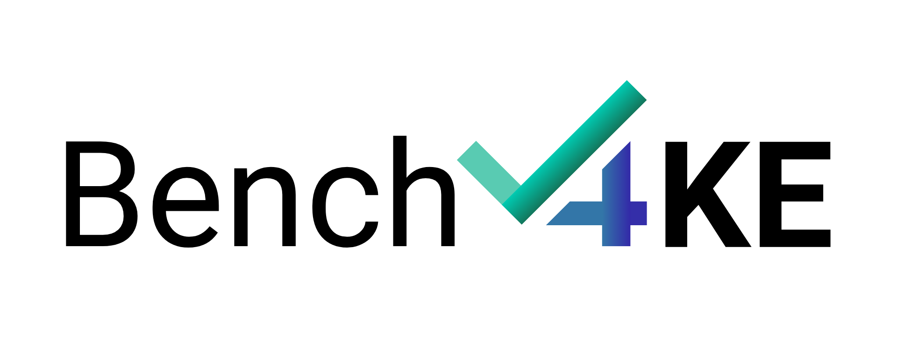

<p align="center">
  
</p>

<h1 align="center">Bench4KE</h1>
<h3 align="center"><i>A Benchmarking System for Evaluating LLM-based Competency Question Generation</i></h3>

**Bench4KE** is a benchmarking framework designed to evaluate KE automation with Large Language Models, currently focusing on the quality of Competency Questions automatically generated by Large Language Models.

CQs are natural language questions used by ontology engineers to define and validate the functional requirements of an ontology. With the increasing use of LLMs to automate tasks in Knowledge Engineering, the automatic generation of CQs is gaining attention. However, current evaluation approaches lack standardization and reproducibility.

**Bench4KE** addresses this gap by providing:

## Key Features

- A gold standard dataset derived from real-world ontology engineering projecs  
- Multiple evaluation metrics:
  - Cosine Similarity
  - Jaccard Similarity
  - LLM-based semantic analysis (via OpenAI's GPT-4 model)
- Visual heatmaps for comparing generated and manually crafted CQs
- Modular and extensible architecture to support the upload of a custom dataset and additional KE tasks in the future

## Directory Contents

| File / Folder             | Description |
|--------------------------|-------------|
| `app/`                   | Contains the FastAPI application modules and related components. |
| `benchmarkdataset.csv`   | This is the gold standard dataset of manually crafted CQs used for evaluation. |
| `tests/`                 | Directory for test cases and testing utilities. |
| `tutorial/`              | Tutorial materials to use the API. |
| `cq_generator_app.py`    | Example of a CQ generation application that is compatible with the API. |
| `bench4ke-validate-ui.py`| Web interface built on the API. |


## Usage

To evaluate a CQ Generation tool using **Bench4KE**, follow the steps below:

### 1. Setup

Ensure you have Python 3.8 or higher installed. 

### 2. Install Dependencies 

Download the required dependencies:
```bash
pip install -r requirements.txt
```

### 3. Run the Benchmark App

Launch the benchmarking application by running:
```bash
uvicorn app.main:app --reload --host 127.0.0.1 --port 8000
```

This will start a FastAPI-based service that guides you through the evaluation process.

### 3. Provide a CQ Generator Link
Once the app is running, you will be prompted to provide the URL of the CQ generation tool you want to evaluate. This tool should expose an endpoint that returns generated CQs for a given ontology or prompt.

### 4. Select Evaluation Data
You can evaluate your generator against:

1. The default gold standard dataset: benchmarkdataset.csv (provided in the repository)
2. A custom CSV file of manually crafted Competency Questions (structure should match benchmarkdataset.csv)

### 5. Review Results
Evaluation results will be saved in your terminal and/or served via the app's UI. Outputs include:

1. Similarity scores per CQ
2. Heatmaps for a visual comparison

## Citation
```
@misc{bench4ke_2025,
  title        = {{Bench4KE}: A Benchmarking System for Evaluating LLM-based Competency Question Generation},
  howpublished = {\url{https://github.com/fossr-project/ontogenia-cini}},
  note         = {Commit accessed 29~Apr~2025},
  year         = {2025}
}
```

## License
Licensed under the [Apache License](./LICENSE).

