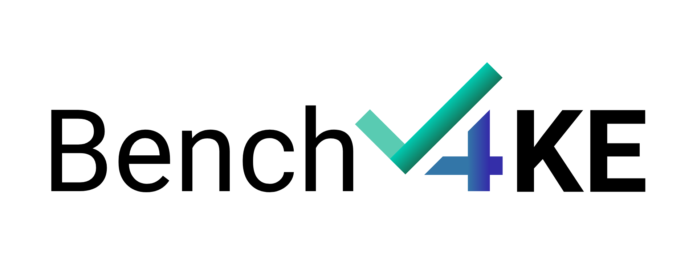

<p align="center">
  
</p>

<h1 align="center">Bench4KE</h1>
<h3 align="center"><i>A Benchmarking System for Evaluating Knowledge Engineering Automation Tasks</i></h3>

<p align="center">
  <a href="https://github.com/fossr-project/ontogenia-cini"></a>
  <a href="https://github.com/fossr-project/ontogenia-cini/blob/main/restapi/tutorial/Bench4KE%20Tutorial.pdf"></a>
  <a href="https://docs.google.com/forms/d/e/1FAIpQLSfpYHGzA2r0wKCq0xEVIkPBKKol6umiKn1URAc17f709DKMKg/viewform?usp=header"></a>
  <a href="./LICENSE"></a>
</p>

**Bench4KE** is a benchmarking framework designed to evaluate KE automation with Large Language Models. It supports both Competency Question (CQ) generation evaluation and ontology generation benchmarking.

CQs are natural language questions used by ontology engineers to define and validate the functional requirements of an ontology. With the increasing use of LLMs to automate tasks in Knowledge Engineering, the automatic generation of CQs is gaining attention. However, current evaluation approaches lack standardization and reproducibility.

**Bench4KE** addresses this gap by providing:

## Key Features

- A gold standard dataset derived from real-world ontology engineering projects  
- Multiple evaluation metrics:
  - Cosine Similarity
  - BERTScore-F1
  - Jaccard Similarity
  - BLEU
  - ROUGE-L
  - Hit Rate
  - LLM-based semantic analysis (via OpenAI models)
- Visual heatmaps for comparing generated and manually crafted CQs
- Ontology generation benchmarking:
  - Multiple ontology-generation systems exposed via a stable API contract:
    - `ontogenia` (Memoryless CQ-by-CQ)
    - `ontogenia-mp` (incremental prompting / Ontogenia-style)
    - `domain-ontogen` (Domain-OntoGen)
    - `neon-gpt` (NeOn-GPT with tool-driven repair loops)
    - `neon-gpt-llms4life` (NeOn-GPT Extended / LLMs4Life paper pipeline)
  - OntoMetrics-style structural metrics
  - OOPS! pitfall detection
  - LLM-based evaluation (OE-Assist prompt with yes/no + SPARQL)
- Modular and extensible architecture to support the upload of a custom dataset, additional KE tasks and other evaluation metrics in the future

## Directory Contents

| File / Folder             | Description |
|--------------------------|-------------|
| `restapi/app/`                   | FastAPI application (CQ validation + ontology benchmark runner). |
| `restapi/app/benchmarkdataset.csv` | Gold standard dataset of manually crafted CQs used for evaluation. |
| `datasets/ontology_generation/`  | Ontology-generation datasets (normalized JSONL) + prompts. |
| `restapi/ontology_adapter.py`    | Ontology generation adapter (implements the five systems listed above). |
| `restapi/cq_generator_app.py`    | Example CQ generation application compatible with the API. |
| `restapi/bench4ke-validate-ui.py`| Web UI for CQ validation and ontology generation/benchmarking. |
| `WordNet/`                       | WordNet files required by the OOPS! Docker image. |
| `HermiT/`                        | Optional local HermiT JAR for NeOn consistency checks. |
| `restapi/tests/`                 | Tests for the API and utilities. |
| `restapi/tutorial/`              | Tutorial materials to use the API. |

## Configuration (.env)

Create a `.env` file in the repo root by copying the example:

```bash
cp .env.example .env
```

Then edit the values you need (see comments inside `.env.example`).

Essentials:
- `OPENAI_API_KEY` (required for any real run)
- `OOPS_API_URL` is required only if you want OOPS enabled; leave empty to skip it. For local Docker use `http://localhost:8080/OOPS/rest`.

Optional with defaults:
- `OPENAI_MODEL` defaults to `gpt-4o-mini`
- `EXTERNAL_CQ_GENERATION_URL` defaults to `http://127.0.0.1:8001/newapi`
- `EXTERNAL_ONTOLOGY_SERVICE_URL` defaults to `http://127.0.0.1:8020/generate_ontology`
- `ONTOLOGY_SYSTEM` defaults to `ontogenia`
- `ONTOLOGY_EXTERNAL_TIMEOUT` defaults to `300` seconds
- `OOPS_AFFECTED_ELEMENTS_MAX` defaults to `50` (caps affected-element samples in parsed OOPS output)

Optional (NeOn pipelines):
- `HERMIT_AUTO=true` enables best-effort local HermiT checks if a JAR is found in `HermiT/`
- `HERMIT_STRIP_REMOTE_IMPORTS=1` (default) strips remote `owl:imports` before invoking HermiT to avoid network-dependent failures

Activate the `.env` before running services:

```bash
source .env
```

Most services also load `.env` automatically via `python-dotenv`, but exporting it explicitly keeps CLI runs consistent.

### OOPS (local Docker + WordNet)
OOPS requires WordNet to be mounted in the container at:
`/usr/local/tomcat/WordNet/WordNet-3.0/dict/index.sense`.

Ensure your repo has:
```
WordNet/WordNet-3.0/dict/index.sense
```

Run OOPS locally:
```bash
docker run --rm -v "$PWD/WordNet:/usr/local/tomcat/WordNet" -p 8080:8080 mpovedavillalon/oops:v1
```

Set the endpoint for the benchmark:
```
OOPS_API_URL=http://localhost:8080/OOPS/rest
```

## Usage

To evaluate a CQ Generation tool or an ontology generation system using **Bench4KE**, follow the steps below:

### 1. Setup

Ensure you have Python 3.8 or higher installed. 

### 2. Install Dependencies 

Download the required dependencies:
```bash
pip install -r requirements.txt
```

### 3. Run the Services

Start the Bench4KE API:
```bash
cd restapi
python3 -m uvicorn app.main:app --reload --host 127.0.0.1 --port 8000
```

Start the CQ generator service (for CQ validation):
```bash
cd restapi
python3 cq_generator_app.py
```

Start the ontology adapter (for ontology benchmarking):
```bash
cd restapi
python3 ontology_adapter.py
```

### 3b. (Optional) Direct ontology generation (adapter API)
You can call the adapter directly (useful for quick smoke tests without running metrics):
```bash
curl -s -X POST http://127.0.0.1:8020/generate_ontology \
  -H 'Content-Type: application/json' \
  -d '{
    "system": "ontogenia",
    "dataset_id": "smoke-ui-1",
    "scenario": "Wine domain.",
    "competency_questions": ["Which grape varieties are used in a specific wine?"],
    "metadata": {"model":"gpt-4o-mini"}
  }' | python3 -m json.tool
```

### 4. CQ Validation
Run CQ validation via API:

```bash
curl -X POST http://127.0.0.1:8000/validate/ \
  -F use_default_dataset=true \
  -F external_service_url=http://127.0.0.1:8001/newapi \
  -F validation_mode=all \
  -F save_results=true
```

Results are saved under:
```
restapi/outputs/cq_validation/
```

### 5. Ontology Benchmark
Run ontology benchmarking via API:

```bash
curl -X POST http://127.0.0.1:8000/ontology/run \
  -H "Content-Type: application/json" \
  -d '{
    "use_default_dataset": true,
    "system": "ontogenia",
    "max_items": 5,
    "evaluation_mode": "all",
    "external_service_url": "http://127.0.0.1:8020/generate_ontology",
    "save_results": true,
    "model": "gpt-4o-mini",
    "llm_eval_model": "gpt-4o-mini"
  }'
```

Results are saved under:
```
restapi/outputs/ontology_benchmark/
```

Paper-faithful Domain-OntoGen mode (one ontology per CQ):
```bash
curl -X POST http://127.0.0.1:8000/ontology/run \
  -H "Content-Type: application/json" \
  -d '{
    "use_default_dataset": true,
    "system": "domain-ontogen",
    "domain_ontogen_mode": "per_cq",
    "max_items": 1,
    "evaluation_mode": "all",
    "external_service_url": "http://127.0.0.1:8020/generate_ontology",
    "save_results": true,
    "model": "gpt-4o-mini",
    "llm_eval_model": "gpt-4o-mini"
  }'
```

### 6. Web UI
Launch the UI:
```bash
cd restapi
python3 bench4ke-validate-ui.py
```
Open `http://127.0.0.1:5000` and use the tabs:
- **CQ Validation**: validates external CQ generators against the default dataset
- **Ontology Generate**: calls the ontology adapter directly with a custom payload
- **Ontology Benchmark**: runs the full benchmark (generation + metrics) and saves artifacts

In the **Ontology Benchmark** tab:
- **Dataset path (optional)**: point to a single normalized `.jsonl` (e.g. `datasets/ontology_generation/normalized/ontogenia.jsonl`) or to a directory containing multiple `.jsonl` files. If empty, the API uses `ONTOLOGY_DATASET_DIR`.
- **Inline items (JSON, optional)**: run a custom list of items without touching the on-disk datasets. Example:

    ```json
    [
      {
        "system": "ontogenia",
        "dataset_id": "ui-smoke-1",
        "scenario": "Wine domain.",
        "competency_questions": ["Which grape varieties are used in a specific wine?"]
      }
    ]
    ```

## Citation
```
@misc{bench4ke_2025,
  title        = {{Bench4KE}: A Benchmarking System for Evaluating LLM-based Competency Question Generation},
  howpublished = {\url{https://github.com/fossr-project/ontogenia-cini}},
  note         = {Commit accessed 29~Apr~2025},
  year         = {2025}
}
```

## License
Licensed under the [Apache License](./LICENSE).
